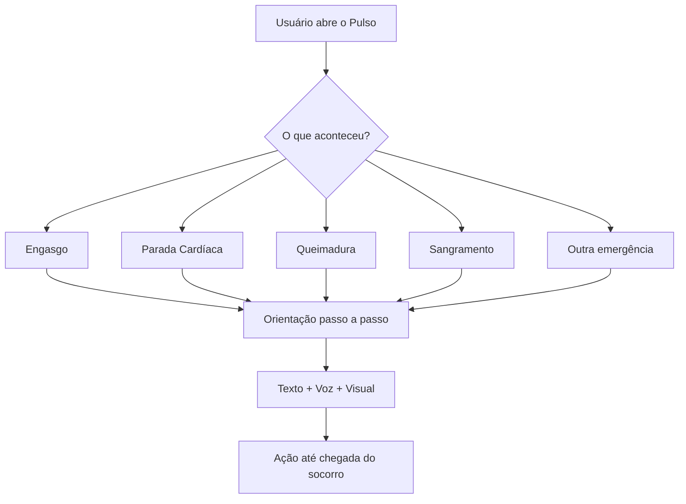

# ❤️ PULSO

## Primeiros Socorros Inteligentes

<p align="center">
  
</p>

<h3 align="center">
  Quando cada segundo importa, o Pulso guia o primeiro cuidado.
</h3>

<p align="center">
  Uma plataforma digital criada para orientar pessoas em situações de emergência através de tecnologia, acessibilidade e informação confiável.
</p>

<p align="center">
  
  
  
  
</p>

---

# 🚨 Sobre o Projeto

O **PULSO — Primeiros Socorros Inteligentes** é uma plataforma criada para ajudar pessoas comuns a tomarem as primeiras atitudes diante de uma emergência.

Antes do atendimento profissional chegar, existe alguém próximo da situação.

O Pulso nasceu para responder uma pergunta:

> "O que eu faço agora?"

Através de orientações simples, visuais e acessíveis, a plataforma guia o usuário durante os primeiros minutos de uma ocorrência.

---

# ⏱️ Primeiro Minuto

## O modo emergência do Pulso

O **Primeiro Minuto** é uma experiência criada para momentos críticos.

Sem login.
Sem cadastro.
Sem burocracia.

Apenas:

```
🚨 Abrir
      ↓
🔎 Identificar
      ↓
📖 Seguir orientação
      ↓
❤️ Ajudar
```

Pensado para situações onde a pessoa pode estar:

* 😰 Nervosa
* 😨 Assustada
* ⏳ Sem tempo
* ❓ Sem conhecimento técnico

---

# 💡 Como funciona?



---

# 🧠 Recursos

## ❤️ Pulso Emergência

Guia interativo para situações como:

* 🫁 Falta de respiração
* ❤️ Parada cardíaca
* 😮 Engasgo
* 🩸 Sangramentos
* 🔥 Queimaduras
* 🧠 Convulsões
* 🚗 Acidentes
* 👶 Emergências infantis
* 👴 Emergências com idosos

---

## 🗣️ Pulso Voz

Um assistente que acompanha o usuário.

Características:

✅ Leitura das instruções
✅ Orientação por áudio
✅ Repetição dos passos
✅ Comandos de voz

Exemplo:

> "Estou aqui com você. Vamos fazer uma etapa de cada vez."

---

## 👁️ Pulso Visual

Aprendizado através de:

* Ilustrações
* Animações
* Vídeos curtos
* Simulações

Porque em uma emergência, ver pode ser mais fácil do que ler.

---

## 📱 Pulso Offline

Criado como uma PWA:

* Instalação no celular
* Uso sem internet
* Acesso rápido
* Conteúdo essencial disponível offline

---

# ♿ Acessibilidade

O Pulso foi pensado para diferentes públicos:

* 👴 Idosos
* 👶 Crianças
* ♿ Pessoas com deficiência
* 🌎 Pessoas com diferentes idiomas

Recursos:

* 🔊 Leitura de tela
* 🗣️ Controle por voz
* 👁️ Alto contraste
* 🔤 Fonte ampliada
* 🤟 Libras futuramente

---

# 🛠️ Tecnologias

## Front-end

<p>

</p>

* HTML5
* CSS3
* JavaScript Vanilla

## Backend

<p>

</p>

* Node.js
* Express.js

## Arquitetura

```
Frontend
   |
   |
JSON Local
   |
   |
Backend Node.js
```

Sem banco de dados inicialmente.

Os protocolos são armazenados em arquivos locais:

```
data/
 └── protocolos.json
```

---

# 📂 Estrutura do Projeto

```
PULSO/

├── index.html

├── css/
│   └── style.css

├── js/
│   ├── app.js
│   ├── voz.js
│   └── protocolos.js

├── data/
│   └── protocolos.json

├── assets/
│   ├── imagens
│   ├── vídeos
│   └── áudios

├── manifest.json

├── service-worker.js

└── backend/
    └── server.js
```

---

# 🚀 Roadmap

## Fase 1 — MVP

[x] Interface inicial
[x] Protocolos básicos
[x] Sistema offline
[ ] Assistente de voz
[ ] Animações educativas

## Fase 2 — Expansão

[ ] Aplicativo Android
[ ] Extensão de navegador
[ ] WhatsApp Bot
[ ] Mais idiomas
[ ] Libras

## Fase 3 — Ecossistema Pulso

[ ] Pulso Escola
[ ] Pulso Empresas
[ ] Pulso Comunidade
[ ] Treinamentos em primeiros socorros

---

# 🌎 Impacto

O Pulso busca transformar tecnologia em cuidado.

Porque muitas vezes a primeira pessoa a chegar não é um profissional de saúde.

É alguém próximo.

E essa pessoa precisa saber:

**o que fazer, como fazer e quando fazer.**

---

# ❤️ Nossa missão

> Tornar o conhecimento de primeiros socorros acessível para todos.

---

<p align="center">

## ❤️ PULSO

### Quando cada segundo importa, o Pulso guia o primeiro cuidado.

</p>
